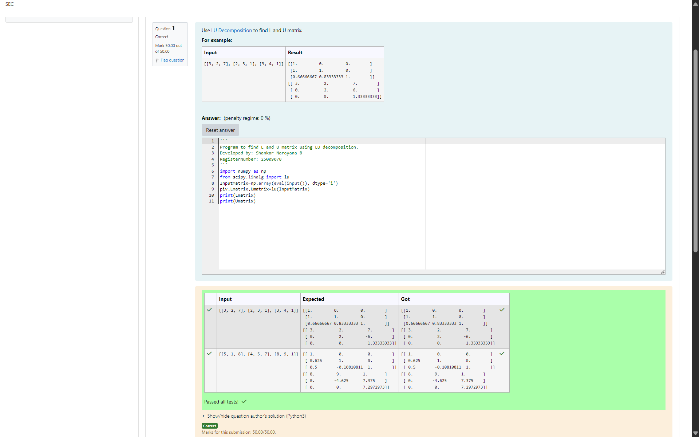
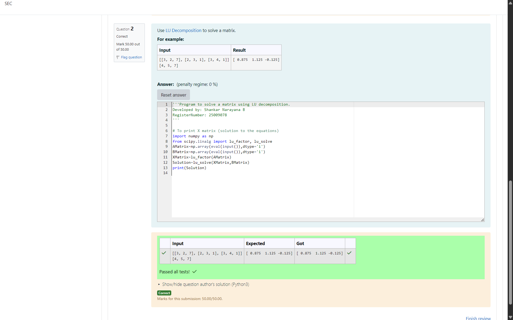

# LU Decomposition 

## AIM:
To write a program to find the LU Decomposition of a matrix.

## Equipments Required:
1. Hardware – PCs
2. Anaconda – Python 3.7 Installation / Moodle-Code Runner

## Algorithm
1. Read the input matrix A and store it as an array.

2. Apply LU decomposition on matrix A to factor it into L (lower triangular matrix) and U (upper triangular matrix).

3. Extract the L matrix and U matrix from the decomposition result.

4. Print the L matrix and U matrix as the output.

## Program:
(i) To find the L and U matrix
```
'''
Program to find L and U matrix using LU decomposition.
Developed by: Shankar Narayana B
RegisterNumber: 25009078
'''
import numpy as np
from scipy.linalg import lu
InputMatrix=np.array(eval(input()), dtype='i')
piv,Lmatrix,Umatrix=lu(InputMatrix)
print(Lmatrix)
print(Umatrix)

```
(ii) To find the LU Decomposition of a matrix
```
'''Program to solve a matrix using LU decomposition.
Developed by: Shankar Narayana B
RegisterNumber: 25009078
'''

# To print X matrix (solution to the equations)
import numpy as np
from scipy.linalg import lu_factor, lu_solve
AMatrix=np.array(eval(input()),dtype='i')
BMatrix=np.array(eval(input()),dtype='i')
XMatrix=lu_factor(AMatrix)
Solution=lu_solve(XMatrix,BMatrix)
print(Solution)

```

## Output:





## Result:
Thus the program to find the LU Decomposition of a matrix is written and verified using python programming.

